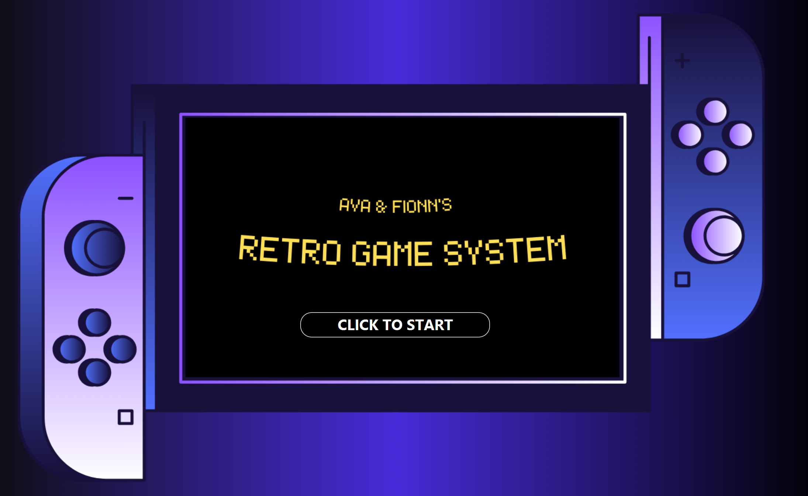

## About the Project
This project was developed by Ava Neary and Fionn Reilly.

The Retro Video Games Information System is a Java-based application developed for our Data Structures and Algorithms 1 assessment in our second year of college. This project marks our first team-based assignment and GitHub project.

It serves as a demonstration of our collaborative efforts and showcases our knowledge in designing and programming applications. 
Notably, we ensured the project was developed in respect of the brief by implementing all data structures and algorithms from scratch, without relying on existing Java collections, reflecting our commitment to mastering fundamental concepts taught in the course.

### Project Objective

The primary goal of this project was to design and implement a robust system for storing, retrieving, and presenting information about retro video games and the machines they ran on. Within the scope of our Data Structures and Algorithms course, we were tasked with not only demonstrating our knowledge of key data structures but also showcasing our ability to collaborate effectively.

## GUI Interface

### Team Collaboration
This project wasn't just a display of individual skills but a collaborative effort between Fionn and I. Working together and leveraging our strengths allowed us to efficiently navigate through the development process, ensuring the sucess of the project.

Throughout the collaborative development process, we navigated through different aspects of the project, from designing the user interface to implementing data structures and algorithms. Regular communication, mutual respect for ideas, and the ability to seamlessly integrate our contributions are evident in every feature and functionality of the Retro Video Games Information System.

## Java and JavaFX 

In our Java-based application, we used JavaFx for our front-end development. We developed custom Abstract Data Types (ADTs) and implemented custom sorting and hashing algorithms within our system. Beyond the backend, this project serves as a testament to our collective front-end development skills. The integration of JavaFX brought our project to life, allowing us to create a trendy and user-friendly UI design that complements the functionality of our application. Each feature reflects our commitment to delivering a well-designed and functional project for our assessment.

### Assessment Brief

Here is the link for the project brief and marking scheme: | https://github.com/Ayyvah/DSA-CA2-Retro-Game-System/blob/62fffffaf16a9c0955f38bd28e9e60313c2a9fd6/CA%20Exercise%202%202023.pdf 

### Project Feedback 
We received a marking of 100% for this project.
